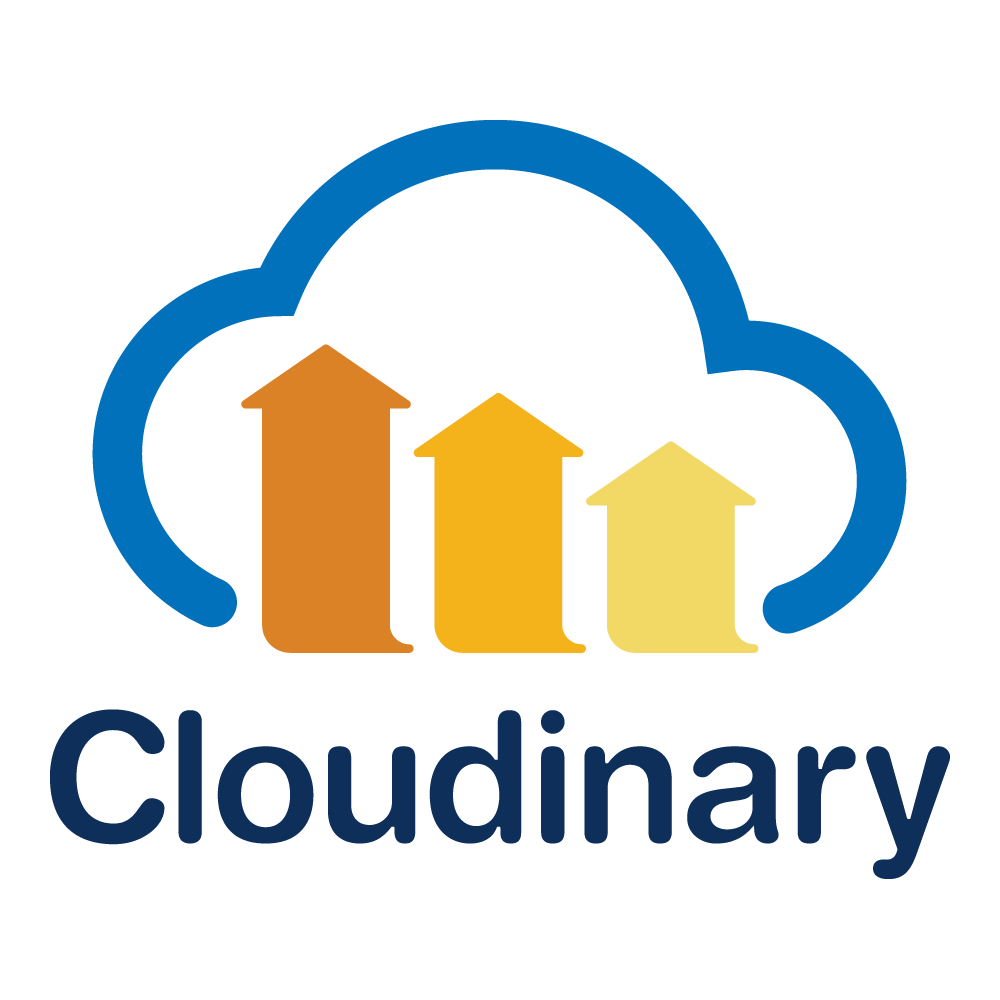

# Apoc-a-Chill

  
**Survive. Connect. Thrive. Even in the Apocalypse.**

---

## 🚀 Overview

**Apoc-a-Chill** is a platform designed to help humanity stay connected and survive in a zombie-infested apocalyptic world. Born out of **Hackocalypse**, a hackathon organized by Microsoft Learn Student Ambassadors - KIIT Chapter, our solution addresses the unique challenges of such a scenario. 

### Problem Statement
> Imagine a world overrun by zombies, where you and a few friends scattered across the globe are the last survivors. How can you collaborate, communicate, and stay safe?  

**Apoc-a-Chill** is our answer: an all-in-one survival platform packed with features to keep you and your friends connected, informed, and alive.  

---

## 🌟 Key Features

### 🔒 Robust Authentication System
Secure user login ensures only verified survivors can use the platform.

### 🌐 Real-time Communication
Stay connected with friends and other survivors from across the globe using real-time chat.

### 🔄 Resource Trading
- **Barter Exchange**: Trade items directly.
- **Monetary Exchange**: Exchange resources using money.
  
The choice is yours!

### 🗺️ Survival Scanner
Mark **danger zones** and **safe zones** on the map in real-time, helping others navigate the apocalypse safely.

### 🤖 ApocaAI
A chatbot trained to assist users with any queries related to surviving the apocalyptic era.

### 🚨 SOS Alerts
Raise alerts during emergencies. Share your location and send notifications to social media groups like Telegram for immediate help.

### 🍎 Edibility Checker
Upload images of food, and our model will analyze if it's safe to eat using **AWS Rekognition**.

---

## 🛠️ Tech Stack

| **Tech**       | **Used For**                           |
|-----------------|---------------------------------------|
|    | Full-stack development                 |
|           | Backend AI/ML models                   |
|             | Server-side machine learning models    |
|  | Real-time communication                 |
|         | Interactive maps for Survival Scanner  |
|  | Food edibility analysis                |
|   | Media storage                          |

---

## 🖥️ Installation and Setup

Follow the steps below to set up the project locally:

### Install Client Dependencies
```bash
cd client/
npm i
```

### Install Server Dependencies
```bash
cd ../server
npm i
```

### Install Model Dependencies
```bash
cd ../
pip install -r requirements.txt
```

### Run the Client and Server Simultaneously
```bash
npm run start:all
```

### Run the Flask Server
```bash
python server/python/server.py
```

---

## 🤝 Contributors

- **Sambit Mondal**  
  [GitHub](https://github.com/Sambit-Mondal)
  [Linkedin](https://linkedin.com/in/sambitm02)
- **Adarsh Rout**  
  [GitHub](https://github.com/AdarshRout)
  [Linkedin](https://linkedin.com/in/adarsh-rout-only568)
  
---

## 📄 License
This project is licensed under the MIT License. See the [LICENSE](https://github.com/Sambit-Mondal/Apoc-a-chill/blob/main/LICENSE) file for details.

---

## 🌟 Acknowledgments

We are grateful to the **Microsoft Learn Student Ambassadors - KIIT Chapter** for organizing this amazing hackathon. Special thanks to our mentors and teammates for their support and collaboration!
